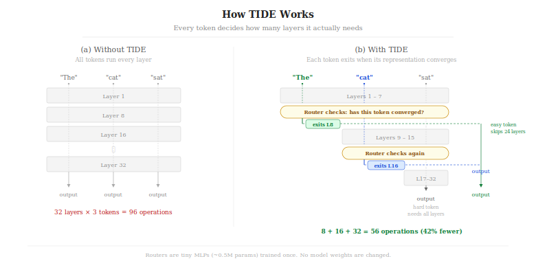

# TIDE -- Token-Informed Depth Execution

<p align="center">
  
</p>

**Make any LLM faster by skipping layers tokens don't need.**

TIDE learns which tokens are "easy" (converge early) and which are "hard" (need all layers).
Easy tokens exit early. Hard tokens go deep. No model retraining. No architecture changes.
Drop it onto any HuggingFace model in 3 lines.

## Install

```bash
pip install tide-inference
```

From source (includes CUDA kernels for max speed):

```bash
git clone https://github.com/RightNow-AI/TIDE.git
cd TIDE
pip install -e ".[test]"    # auto-detects your GPU architecture
```

> No GPU? That's fine. TIDE falls back to pure PyTorch automatically.

## 3-Line Integration

```python
from transformers import AutoModelForCausalLM, AutoTokenizer
import TIDE

model = AutoModelForCausalLM.from_pretrained("meta-llama/Llama-3.1-8B-Instruct",
                                              torch_dtype="float16", device_map="auto")
tokenizer = AutoTokenizer.from_pretrained("meta-llama/Llama-3.1-8B-Instruct")

# One-time: calibrate routers (~5 min)
TIDE.calibrate(model, tokenizer, save_path="router.pt")

# From now on: 3-line inference
engine = TIDE.TIDE(model, router_path="router.pt")
output = engine.generate(tokenizer("Hello", return_tensors="pt").input_ids.cuda(),
                         max_new_tokens=128)
print(tokenizer.decode(output[0]))
```

## How It Works

TIDE has two stages:

```
  STAGE 1: CALIBRATE (one-time)            STAGE 2: INFERENCE (every request)
  ==============================            =================================

  Feed ~2000 texts through model.           Run forward pass, evaluate routers
  At every 4th layer, ask:                  at each checkpoint. First router
  "Is this token's hidden state             that says 'converged' -> use that
   the same as the final layer?"            layer's output for this token.

  cosine_sim(layer_8, layer_32) > 0.98?     +-------+
  -> YES = converged at layer 8             | input |
  -> NO  = needs more layers                +---+---+
                                                |
  Train tiny MLP per checkpoint:            +---v---+
  hidden_state -> [128 dims] -> sigmoid     | Layers|
                                            | 1..7  |  (all tokens run these)
  Saves to router.pt (~1MB)                 +---+---+
                                                |
                                            +---v---------+
                                            | Router @ 8  |---> score > 0.85?
                                            +---+---------+     YES: exit token
                                                |               NO:  continue
                                            +---v---+                 |
                                            | Layers|           +-----v-----+
                                            | 9..11 |           | Use layer |
                                            +---+---+           | 8 output  |
                                                |               +-----------+
                                            +---v---------+
                                            | Router @ 12 |---> score > 0.85?
                                            +-------------+     (repeat...)
```

## Works With Any Model

TIDE auto-probes your model's architecture. No adapter code needed.

| Model Family | Examples | Status |
|---|---|---|
| LLaMA | LLaMA 3.3, LLaMA 4 Scout/Maverick | Benchmarked |
| DeepSeek | DeepSeek R1, R1 Distill 8B/32B/70B | Benchmarked |
| Qwen | Qwen3 8B/32B, Qwen 2.5 | Benchmarked |
| Mistral | Mistral Small 3.1, Mixtral | Supported |
| Gemma | Gemma 3 12B/27B | Supported |
| GPT-2 | GPT-2, DistilGPT-2 | Tested |
| GPT-NeoX | Pythia, GPT-NeoX-20B | Supported |
| Phi | Phi-3, Phi-4 | Supported |
| Falcon | Falcon 7B/40B | Supported |
| OPT | OPT-1.3B through OPT-30B | Supported |
| **Anything else** | Any `AutoModelForCausalLM` | Auto-probed |

```python
# All of these just work:
model = AutoModelForCausalLM.from_pretrained("gpt2")
model = AutoModelForCausalLM.from_pretrained("EleutherAI/pythia-1.4b")
model = AutoModelForCausalLM.from_pretrained("microsoft/phi-2")
engine = TIDE.TIDE(model, "router.pt")  # UniversalAdapter handles it
```

## Works On Any GPU

GPU architecture is auto-detected at install time.

| GPU | Arch | Status |
|---|---|---|
| V100 | sm_70 | Supported |
| T4 | sm_75 | Supported |
| A100 | sm_80 | Benchmarked |
| A10G | sm_86 | Tested in CI |
| L4 / L40S | sm_89 | Supported |
| H100 / H200 | sm_90 | Supported |
| B100 / B200 | sm_100 | Supported |
| GB200 / GB300 | sm_120 | Supported (PTX fallback) |

Override: `TORCH_CUDA_ARCH_LIST="8.6" pip install .`

No GPU? TIDE works in pure PyTorch (CPU fallback, no CUDA kernels needed).

## Benchmark Results

All benchmarks on **NVIDIA A100-SXM4-40GB**, bf16, 2000 WikiText calibration samples.
16 prompts (8 reasoning/math + 8 general knowledge).

### Prefill: 100% Exit Rate

Every token finds an early exit point. On reasoning + general prompts:

```
Model                       Layers  Exit Rate  Early Exits (before last checkpoint)
==========================  ======  =========  =====================================
DeepSeek R1 Distill 8B       32      100%      5% exit at Layer 11 (1/3 depth)
Qwen3 8B                     36      100%      10% exit across L11 + L23 (1/3-2/3)
```

### Latency: Up to 7% Faster Prefill

Single reasoning prompt, 20 runs averaged on A100:

```
Model                    Baseline     TIDE          Speedup
=====================    ==========   ===========   =======
DeepSeek R1 Distill 8B   39.08ms      36.26ms       -7.2%
Qwen3 8B (36 layers)     46.82ms      44.14ms       -5.7%
```

### Throughput: Up to 8% More Tokens/sec

```
Model                    Batch   Baseline       TIDE           Gain
=====================    =====   ============   ============   =====
DeepSeek R1 Distill 8B     1       973 tok/s    1,037 tok/s    +6.5%
Qwen3 8B                   1       258 tok/s      271 tok/s    +5.0%
Qwen3 8B                   8     1,781 tok/s    1,926 tok/s    +8.1%
```

### Decode: 99% of Reasoning Tokens Exit Early

DeepSeek R1 Distill 8B solving a math problem, 256 tokens, `temperature=0`:

```
Threshold   Decode Exit Rate   Unique Tokens   Quality
=========   ================   =============   =========================
1.0 (off)        0%                99          Correct solution
0.85            98%                95          Correct solution
0.70            99%                95          Correct solution (stable)
0.50            99.6%             95          Correct solution (stable)
```

**99% of decode tokens exit early** while the model still solves the math
problem correctly. Output remains coherent with 95+ unique tokens.

### Convergence: 340K Tokens Analyzed

```
Model                    Layers   Tokens      Finding
=====================    ======   ========    =====================================
DeepSeek R1 Distill 8B    32     339,853     100% converge by L31
Qwen3 8B                  36     314,530     100% converge by L35
GPT-2 (124M)              12      78,843     100% converge by L11
```

The penultimate checkpoint captures the full model output for every token —
the last few layers contribute negligible change to hidden state representations.

## Tuning the Threshold

The `exit_threshold` controls the quality/speed tradeoff:

```
threshold=0.95   Conservative. Few exits. Highest quality. Minimal speedup.
threshold=0.85   Default. Good balance. Most users start here.
threshold=0.70   Aggressive. More exits. Some quality impact.
threshold=0.50   Very aggressive. Test on your specific task.
threshold=0.30   Maximum exits. Only for tasks where quality is less critical.
```

```python
# Conservative (prioritize quality)
engine = TIDE.TIDE(model, "router.pt", config=TIDEConfig(exit_threshold=0.95))

# Aggressive (prioritize speed)
engine = TIDE.TIDE(model, "router.pt", config=TIDEConfig(exit_threshold=0.70))

# Find the sweet spot for your task:
#   python examples/tune_threshold.py --model "your-model"
```

Also tunable: `min_layers` (minimum depth before exits are allowed):

```python
# Force all tokens through at least 16 layers
config = TIDEConfig(exit_threshold=0.85, min_layers=16)
```

## Configuration Reference

```python
from TIDE import TIDEConfig

TIDEConfig(
    # --- Inference ---
    exit_threshold=0.85,       # Router confidence to trigger exit (0.0-1.0)
    min_layers=8,              # Minimum layers before any exit allowed
    checkpoint_interval=4,     # Router placement: every N layers

    # --- Calibration ---
    calibration_samples=2000,  # Number of text samples for calibration
    calibration_dataset="wikitext",  # HuggingFace dataset name
    convergence_threshold=0.98,      # Cosine similarity for "converged" label
    router_bottleneck_dim=128,       # Router MLP hidden size

    # --- Advanced ---
    exit_strategy="identity",        # Exit projection mode
    kv_cache_strategy="zero_pad",    # KV cache handling for skipped layers
    compaction_threshold=0.25,       # Batch compaction trigger ratio
)
```

## Monitoring Exit Stats

```python
engine = TIDE.TIDE(model, "router.pt")
output = engine.generate(input_ids, max_new_tokens=100)

stats = engine.last_stats
print(stats.summary())
# Total tokens: 100, Exited: 72 (72.0%)
#   Layer 7: 23 exits (23.0%)
#   Layer 11: 31 exits (31.0%)
#   Layer 15: 18 exits (18.0%)
#   Ran all layers: 28

print(f"Exit rate: {stats.exit_rate:.1%}")
print(f"Exits per layer: {stats.exits_per_layer}")
```

## Examples

| Example | What it shows |
|---|---|
| [`quickstart.py`](examples/quickstart.py) | Calibrate + generate in 10 lines |
| [`any_model.py`](examples/any_model.py) | UniversalAdapter with GPT-2, Pythia, Phi |
| [`tune_threshold.py`](examples/tune_threshold.py) | Sweep thresholds to find your sweet spot |
| [`huggingface_pipeline.py`](examples/huggingface_pipeline.py) | Drop TIDE into existing HF code |

## Mixed Precision

CUDA kernels natively support fp16 and bf16 inputs. No configuration needed.

```python
# fp16
model = AutoModelForCausalLM.from_pretrained("...", torch_dtype=torch.float16)
engine = TIDE.TIDE(model, "router.pt")  # kernels auto-dispatch to fp16

# bf16
model = AutoModelForCausalLM.from_pretrained("...", torch_dtype=torch.bfloat16)
engine = TIDE.TIDE(model, "router.pt")  # kernels auto-dispatch to bf16
```

## Running Tests

```bash
# CPU tests (no GPU)
TIDE_NO_CUDA=1 pip install -e ".[test]"
pytest tests/ -k "not cuda and not kernels"

# Full suite with CUDA kernels (74 tests)
pip install -e ".[test]"
pytest tests/ -v

# Cloud GPU tests via Modal
modal run modal_setup/ci_app.py
```

## Project Structure

```
TIDE/
├── python/TIDE/              # Python package
│   ├── runtime.py            # TIDERuntime: wrap model + inference
│   ├── calibrate.py          # One-time router calibration
│   ├── config.py             # TIDEConfig
│   ├── router.py             # TokenRouter MLP (tiny, ~0.5M params each)
│   ├── scheduler.py          # ExitStats tracking
│   └── adapters/             # Model architecture adapters
│       ├── universal.py      # Auto-probe any HF model
│       ├── llama.py          # LLaMA built-in
│       ├── mistral.py        # Mistral built-in
│       └── qwen.py           # Qwen built-in
├── csrc/                     # CUDA kernels (optional, for speed)
│   ├── kernels/
│   │   ├── dtype_utils.cuh           # fp16/bf16 load/store helpers
│   │   ├── fused_layernorm_route.cu  # Fused RMSNorm + router scoring
│   │   ├── batch_compact.cu          # Separate continue/exit tokens
│   │   ├── exit_scatter.cu           # Scatter exits to output buffer
│   │   └── exit_projection.cu        # Norm + scatter for exits
│   └── extensions/
│       └── torch_bindings.cpp        # PyTorch bindings
├── examples/                 # Ready-to-run example scripts
├── tests/                    # 74 tests (adapters, calibration, kernels, runtime)
├── benchmarks/               # Modal-based benchmark suite
└── modal_setup/              # Modal cloud GPU configuration
```

## FAQ

**Q: Does TIDE change the model weights?**
No. TIDE is inference-only. Your model weights are frozen. The only new parameters
are the router MLPs (~0.5M params each, stored separately in `router.pt`).

**Q: Does it affect output quality?**
At the default threshold (0.85), quality impact is minimal -- the router only exits
tokens whose hidden state is >98% similar to what the final layer would produce.
Lower thresholds trade more quality for more speed.

**Q: Do I need to recalibrate for different tasks?**
The default WikiText calibration works well across tasks. Task-specific calibration
(using your own dataset) can improve exit rates for specialized domains.

**Q: Can I use TIDE with quantized models (GPTQ, AWQ, GGUF)?**
TIDE works with any model that supports `output_hidden_states=True` in its forward
pass. Most quantized models through HuggingFace transformers support this.

**Q: What's the overhead if no tokens exit?**
Near zero. The routers are tiny MLPs (~0.5M params) evaluated only at checkpoint
layers. With CUDA kernels, router evaluation is fused into a single kernel launch.

## Citation

```bibtex
@software{tide2026,
  title  = {TIDE: Token-Informed Depth Execution},
  author = {RightNow AI},
  year   = {2026},
  url    = {https://github.com/RightNow-AI/TIDE}
}
```

## License

Apache 2.0. See [LICENSE](LICENSE).
